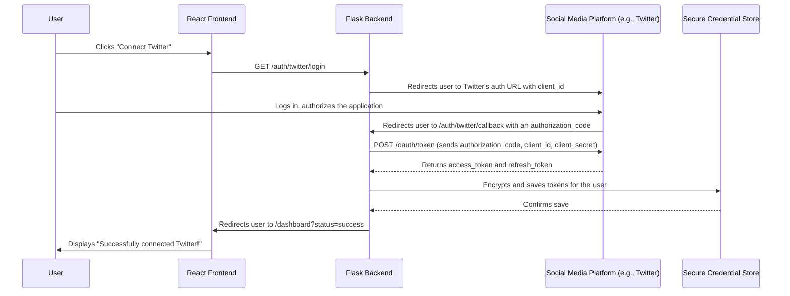
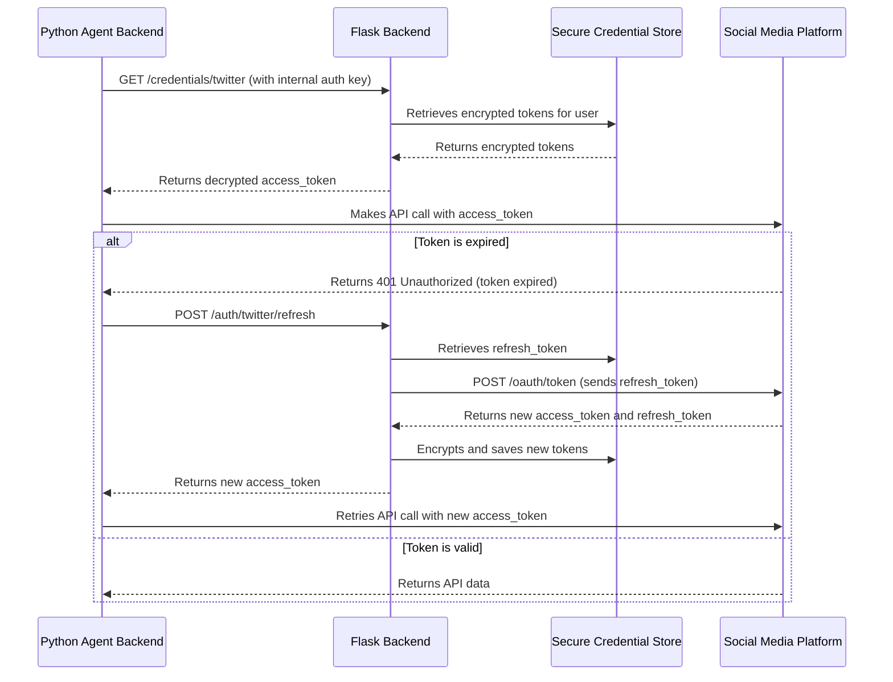

# Architectural Blueprint: Multi-Platform OAuth 2.0 Flow

This document outlines the architecture for a centralized OAuth 2.0 and credential management system. This system will allow a user to securely connect their social media accounts to the agentic workforce application, providing a seamless "just sign in" experience similar to platforms like n8n or Zapier.

## 1. System Components

The system will consist of three main components:

1.  **React Frontend (`/dashboard`):** A user interface where the user can see the status of their connections and initiate the OAuth flow for each platform.
2.  **Flask Backend (`/app`):** A web server that handles the OAuth 2.0 dance, manages token storage, and securely provides credentials to the agent backend.
3.  **Secure Credential Store:** A dedicated, encrypted database or a secure vault service (like HashiCorp Vault) for storing the OAuth tokens. **For simplicity in this blueprint, we will use an encrypted local file.**

## 2. The OAuth 2.0 Authentication Flow

This flow describes how the user connects a single platform (e.g., Twitter). The process is identical for all other platforms.

### Step-by-Step Logic:

1.  **Initiation:** The user clicks a "Connect" button in the React dashboard. This sends a request to our Flask backend.
2.  **Redirect to Provider:** The Flask backend constructs the correct authorization URL for the social media platform (including our app's `client_id` and the `redirect_uri`) and redirects the user's browser to it.
3.  **User Authorization:** The user logs into the social media platform (if not already logged in) and approves the permissions requested by our application.
4.  **Callback with Code:** The platform redirects the user back to the `redirect_uri` we specified (e.g., `https://our-app.com/auth/twitter/callback`). This request includes a temporary `authorization_code`.
5.  **Token Exchange:** The Flask backend receives the `authorization_code`. It then makes a secure, server-to-server POST request to the platform's token endpoint, sending the `authorization_code`, its `client_id`, and its `client_secret`.
6.  **Receive Tokens:** The platform validates the request and returns a short-lived `access_token` and a long-lived `refresh_token`.
7.  **Secure Storage:** The Flask backend **encrypts** both tokens using a strong encryption key (e.g., from the application's environment variables) and saves them to the Secure Credential Store, associated with the user's account.
8.  **Confirmation:** The user is redirected back to the React dashboard with a success message.

## 3. Using and Refreshing Tokens

Once the tokens are stored, the agent backend can securely access them.

### Step-by-Step Logic:

1.  **Agent Request:** When the Python agent backend needs to post to Twitter, it requests the token from the Flask backend.
2.  **Secure Retrieval:** The Flask backend retrieves the encrypted tokens from the store, decrypts the `access_token`, and returns it to the agent backend.
3.  **API Call:** The agent makes the API call.
4.  **Refresh Flow (if needed):**
    *   If the API call fails with a "token expired" error, the agent notifies the Flask backend.
    *   The Flask backend uses the stored `refresh_token` to request a new `access_token` from the social platform.
    *   It securely updates the stored tokens with the new ones.
    *   It returns the new `access_token` to the agent, which can then retry the original API call.

This architecture ensures that all user credentials are handled securely, the user experience is seamless, and the system can maintain long-term, authorized access to the social media platforms.